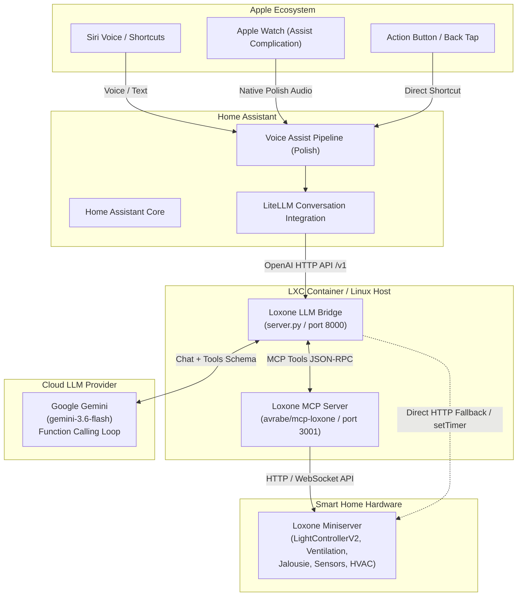

# Loxone LLM Bridge 🏠🤖

> OpenAI-compatible AI Agent bridge for Loxone Miniserver, enabling natural Polish voice and text control via Home Assistant, Siri, iOS Shortcuts, and Apple Watch.

[](LICENSE)
[](https://www.python.org/)
[](https://www.home-assistant.io/integrations/litellm)
[](https://www.loxone.com/)

---

## 📐 Architecture



---

## ✨ Features

- **🗣️ Natural Polish Speech**: System prompts and output formatting tuned specifically for voice synthesizers (clean text without markdown asterisks, hashes, or tables).
- **💡 Smart Lighting & Gen 2 Moods**:
  - Room-level control: *"Włącz światło w salonie"*, *"Zgaś światła w sypialni"*.
  - Full support for Loxone Gen 2 (`LightControllerV2`) predefined scenes and moods: *"Wieczór w salonie"*, *"Noc w sypialni"*, *"Tryb jedzenie w salonie"*, *"Xbox w salonie"*, *"Jasno w kuchni"*.
- **🍃 Ventilation & Recuperation with Timers**:
  - Control room units or whole-house ventilation: Gabinet, Kuchnia, Sypialnia, Cały dom.
  - Native Loxone timers with duration: *"Przewietrz kuchnię na 30 minut"*, *"Ustaw wentylację na 60% na godzinę"*, *"Wyłącz wentylację na 2 godziny"*.
  - Automatic fallback to safe auto mode after the timer expires.
- **🪟 Blinds & Shading**:
  - Full support for Jalousie blocks: *"Zasłoń rolety w salonie"*, *"Otwórz roletę w gabinecie"*.
- **📊 Real-time Sensor & Energy Inquiries**:
  - Digital window/door contacts: *"Które okna są otwarte?"*.
  - Live power meters: *"Ile prądu teraz zużywamy?"*.
  - Temperatures, humidity, and room controllers: *"Jaka jest temperatura w gabinecie?"*.
- **🔒 Zero Leakage Security**:
  - Miniserver credentials stay strictly on your local network.
  - Configurable via environment variables (`.env`).

---

## 🛠️ Prerequisites

- **Loxone Miniserver** (Gen 1 or Gen 2) with network access.
- **Home Assistant** (2024.1+) with the official [LiteLLM integration](https://www.home-assistant.io/integrations/litellm).
- **Google Gemini API Key** (from [Google AI Studio](https://aistudio.google.com/)).
- **Linux host or Proxmox LXC Container** (Debian 12/13 or Ubuntu).

---

## 🚀 Installation & Setup

### 1. Set up the Loxone MCP Server (`mcp-loxone`)

Clone and build the Loxone MCP Server (using the Gen 2 patch from [PR #41](https://github.com/avrabe/mcp-loxone/pull/41)):

```bash
git clone https://github.com/cayco/mcp-loxone.git /opt/mcp-loxone
cd /opt/mcp-loxone
cargo build --release
cp target/release/loxone-mcp-server /usr/local/bin/
```

Create `/etc/mcp-loxone/mcp-loxone.env`:
```ini
LOXONE_HOST=192.168.1.100
LOXONE_USER=admin
LOXONE_PASS=your_loxone_password
```

Install and start the systemd service:
```bash
cp systemd/mcp-loxone.service /etc/systemd/system/
systemctl daemon-reload
systemctl enable --now mcp-loxone.service
```

### 2. Set up the Loxone LLM Bridge

Clone this repository to `/opt/loxone-agent`:

```bash
git clone https://github.com/cayco/loxone-llm.git /opt/loxone-agent
cd /opt/loxone-agent

# Create virtual environment
python3 -m venv venv
source venv/bin/activate
pip install -r requirements.txt
```

Create configuration file `/etc/loxone-agent/agent.env`:
```ini
GEMINI_API_KEY=AIzaSy...your_gemini_api_key...
GEMINI_MODEL=gemini-3.6-flash
PORT=8000
MCP_URL=http://127.0.0.1:3001/mcp
LOXONE_HOST=192.168.1.100
LOXONE_USER=admin
LOXONE_PASS=your_loxone_password
```

Install and start the service:
```bash
cp systemd/loxone-agent.service /etc/systemd/system/
systemctl daemon-reload
systemctl enable --now loxone-agent.service
```

Verify service health:
```bash
curl http://127.0.0.1:8000/v1/models
```

---

## 🏡 Home Assistant Configuration

1. In Home Assistant, go to **Settings** $\rightarrow$ **Devices & Services** $\rightarrow$ **Add Integration**.
2. Search for **LiteLLM**.
3. Fill in the connection settings:
   - **API Base**: `http://<YOUR_BRIDGE_IP>:8000/v1`
   - **API Key**: `dummy` (or any string)
4. Go to **Settings** $\rightarrow$ **Voice Assistants** $\rightarrow$ **Home Assistant**:
   - Set **Conversation Agent** to **LiteLLM**.
   - Set **Language** to **Polish**.

---

## 📱 iOS, Siri & Apple Watch Setup

Because Apple Siri does not support Polish natively, calling Siri via the side button defaults to English speech recognition. To speak Polish reliably:

### Option A: Apple Watch Assist Complication (Recommended for Watch)
1. Install the **Home Assistant** app on Apple Watch.
2. Add the **Assist** complication to your watch face.
3. Tapping the complication opens the native microphone listening in Polish and routes directly to the agent.

### Option B: iOS Action Button / Back Tap
1. On iPhone 15 Pro / 16: Go to **Settings** $\rightarrow$ **Action Button** $\rightarrow$ assign a Shortcut running Home Assistant Assist.
2. On any iPhone: Go to **Settings** $\rightarrow$ **Accessibility** $\rightarrow$ **Touch** $\rightarrow$ **Back Tap** (double/triple tap).

---

## 🗣️ Example Voice Commands

| Category | Example Command (PL) | Description |
|---|---|---|
| **Oświetlenie** | *„Włącz światło w gabinecie”* | Włącza oświetlenie w danym pokoju |
| **Nastroje / Sceny** | *„Wieczór w salonie”* | Aktywuje nastrój Wieczór (ID 1) na LightControllerV2 |
| **Nastroje / Sceny** | *„Włącz tryb jedzenie w salonie”* | Aktywuje nastrój Jedzenie / Obiad (ID 2) |
| **Nastroje / Sceny** | *„Noc w sypialni”* | Aktywuje scenę nocną w sypialni |
| **Wentylacja** | *„Przewietrz gabinet”* | Uruchamia 100% obrotów na domyślne 15 minut |
| **Wentylacja z czasem** | *„Włącz wietrzenie w kuchni na 30 minut”* | Aktywuje timer rekuperacji na 30 minut |
| **Wentylacja** | *„Ustaw wentylację na 60% na godzinę”* | Ustawia 60% prędkości na 60 minut |
| **Wentylacja** | *„Ustaw wentylację na tryb automatyczny”* | Resetuje centrale wentylacyjne do trybu auto |
| **Rolety** | *„Zasłoń rolety w salonie”* | Opuszcza rolety (Jalousie FullDown) |
| **Czujniki** | *„Które okna są otwarte?”* | Sprawdza kontaktrony okienne |
| **Energia** | *„Ile prądu teraz zużywamy?”* | Odczytuje aktualną moc z licznika głównego |

---

## 📄 License

This project is open-source under the [MIT License](LICENSE).
