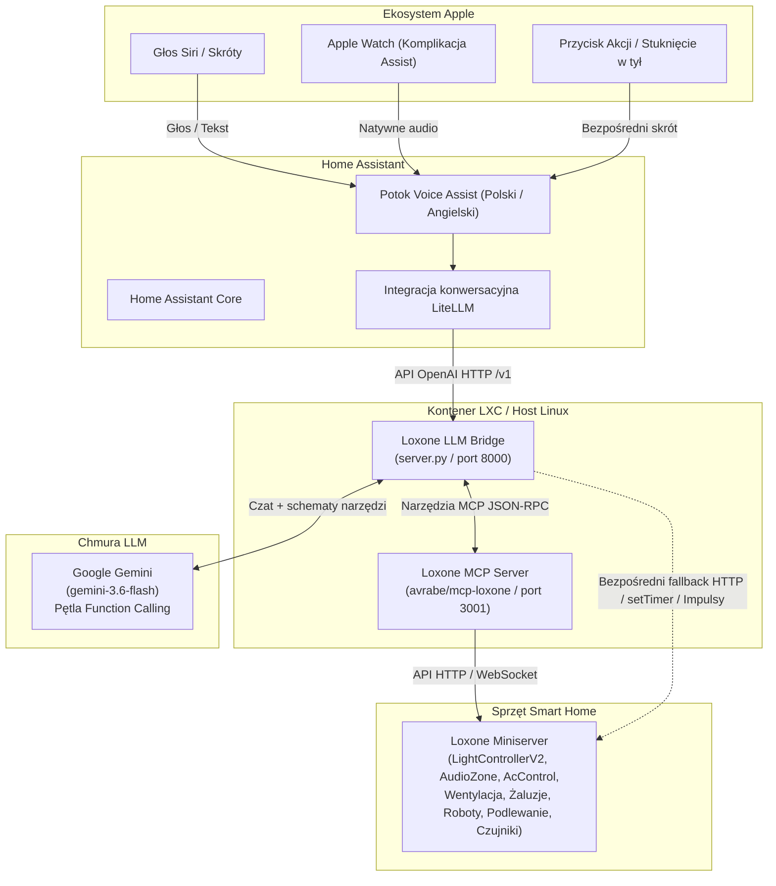

# Loxone LLM Bridge 🏠🤖

> Mostek AI Agent (kompatybilny z OpenAI) dla Loxone Miniserver, umożliwiający naturalne sterowanie głosowe i tekstowe w języku polskim oraz angielskim za pośrednictwem Home Assistant, Siri, Skrótów iOS oraz Apple Watch.

[English (EN)](README.md) | [Polski (PL)](README_PL.md)

[](LICENSE)
[](https://www.python.org/)
[](https://www.home-assistant.io/integrations/litellm)
[](https://www.loxone.com/)

---

## 📐 Architektura



---

## ✨ Funkcje

- **🌐 Wsparcie wielojęzyczne**:
  - Domyślny język angielski (`LANGUAGE=en`).
  - Natywna obsługa języka polskiego (`LANGUAGE=pl`).
  - Formatowanie odpowiedzi dostosowane pod syntezatory mowy (czysty tekst bez gwiazdek markdown, hashy czy tabel).
- **💡 Inteligentne oświetlenie i nastroje Gen 2 (`LightControllerV2`)**:
  - Sterowanie pokojowe: *„Włącz światło w salonie”*, *„Zgaś światła w sypialni”*.
  - Sceny i nastroje: *„Wieczór w salonie”*, *„Noc w sypialni”*, *„Tryb jedzenie w salonie”*, *„Xbox w salonie”*, *„Jasno w kuchni”*.
- **🎵 Multiroom Audio (`AudioZone`)**:
  - Odtwarzanie, pauza, stop, następny/poprzedni utwór, zmiana głośności (0-100%), wyciszanie.
  - Sterowanie strefowe lub całym domem: *„Włącz muzykę w kuchni”*, *„Zatrzymaj muzykę w całym domu”*, *„Ustaw głośność w gabinecie na 30%”*.
- **❄️ Klimatyzacja (`AcControl`)**:
  - Sterowanie jednostkami klimatyzacji (Salon, Sypialnia, Gabinet, Filip, Maciek): *„Włącz klimatyzację w sypialni”*, *„Ustaw klimę w salonie na chłodzenie 21 stopni”*, *„Wyłącz klimatyzację”*.
- **🍃 Wentylacja i rekuperacja z timerami (`Ventilation`)**:
  - Sterowanie pokojami lub całym domem z określonym czasem: *„Przewietrz kuchnię na 30 minut”*, *„Ustaw wentylację na 60% na godzinę”*, *„Wyłącz wentylację na 2 godziny”*.
  - Automatyczny bezpieczny powrót do trybu auto po upływie czasu.
- **🤖 Roboty sprzątające i strefy sprzątania**:
  - Uruchamianie odkurzaczy i mopowania: *„Wyślij Mietka do kuchni”*, *„Włącz mopowanie”*, *„Posprzątaj korytarz na dole”*.
- **🪴 Podlewanie i ogród (`Irrigation`)**:
  - Podlewanie balkonu, ze zbiornika na deszczówkę lub z kranu: *„Podlej balkon”*, *„Włącz podlewanie ze zbiornika”*, *„Zablokuj podlewanie”*.
- **🪟 Automatyczne okna dachowe i żaluzje**:
  - Otwieranie/zamykanie siłowników okien: *„Otwórz okna w domu”*, *„Zamknij wszystkie okna”*.
  - Rolety i żaluzje: *„Zasłoń rolety w salonie”*, *„Otwórz roletę w gabinecie”*.
- **🔔 Domofon, brama i furtka (`Intercom`)**:
  - Otwieranie elektrozamka furtki lub bramy wjazdowej: *„Otwórz furtkę”*, *„Otwórz bramę”*.
- **🔘 Przełączniki i tryby domu (`Switch`)**:
  - Globalne stany domu: *„Wychodzimy z domu”* (tryb poza domem), *„Włącz ciepłą wodę”*, *„Włącz blokadę śniegową”*.
- **📊 Odczyt czujników, energii i alarmu w czasie rzeczywistym**:
  - Kontaktrony okienne i drzwiowe: *„Które okna są otwarte?”*.
  - Pomiar mocy na żywo: *„Ile prądu teraz zużywamy?”*.
  - Temperatury, wilgotność oraz stan alarmu przeciwwłamaniowego.
- **🔒 Bezpieczeństwo i prywatność**:
  - Miniserver i poświadczenia pozostają wyłącznie w Twojej sieci lokalnej.
  - Pełna konfiguracja przez zmienne środowiskowe (`.env`). Żadne hasła ani loginy nie są na stałe w kodzie.

---

## 🛠️ Wymagania

- **Loxone Miniserver** (Gen 1 lub Gen 2) z dostępem sieciowym.
- **Home Assistant** (2024.1+) z oficjalną integracją [LiteLLM](https://www.home-assistant.io/integrations/litellm).
- **Klucz API Google Gemini** (z [Google AI Studio](https://aistudio.google.com/)).
- **Host Linux lub kontener Proxmox LXC** (Debian 12/13 lub Ubuntu).

---

## 🚀 Instalacja i konfiguracja

### 1. Konfiguracja Loxone MCP Server (`mcp-loxone`)

Sklonuj i skompiluj Loxone MCP Server (z poprawkami dla Gen 2 z [PR #41](https://github.com/avrabe/mcp-loxone/pull/41)):

```bash
git clone https://github.com/cayco/mcp-loxone.git /opt/mcp-loxone
cd /opt/mcp-loxone
cargo build --release
cp target/release/loxone-mcp-server /usr/local/bin/
```

Utwórz plik konfiguracyjny `/etc/mcp-loxone/mcp-loxone.env`:
```ini
LOXONE_HOST=192.168.1.100
LOXONE_USER=twoja_nazwa_uzytkownika
LOXONE_PASS=twoje_haslo_loxone
```

Zainstaluj i uruchom usługę systemd:
```bash
cp systemd/mcp-loxone.service /etc/systemd/system/
systemctl daemon-reload
systemctl enable --now mcp-loxone.service
```

### 2. Konfiguracja Loxone LLM Bridge

Sklonuj niniejsze repozytorium do `/opt/loxone-agent`:

```bash
git clone https://github.com/cayco/loxone-llm.git /opt/loxone-agent
cd /opt/loxone-agent

# Utwórz środowisko wirtualne
python3 -m venv venv
source venv/bin/activate
pip install -r requirements.txt
```

Utwórz plik konfiguracyjny `/etc/loxone-agent/agent.env`:
```ini
GEMINI_API_KEY=twoj_klucz_gemini_api
GEMINI_MODEL=gemini-3.6-flash
LANGUAGE=pl
PORT=8000
MCP_URL=http://127.0.0.1:3001/mcp
LOXONE_HOST=192.168.1.100
LOXONE_USER=twoja_nazwa_uzytkownika
LOXONE_PASS=twoje_haslo_loxone
```

Zainstaluj i uruchom usługę:
```bash
cp systemd/loxone-agent.service /etc/systemd/system/
systemctl daemon-reload
systemctl enable --now loxone-agent.service
```

Sprawdź działanie mostka:
```bash
curl http://127.0.0.1:8000/v1/models
```

---

## 🔍 Identyfikatory UUID i ID nastrojów Loxone

Skopiuj plik [`moods.example.json`](moods.example.json) do `moods.json` i uzupełnij go identyfikatorami ze swojego Miniservera:
```json
{
  "light_moods": { ... },
  "ventilation_controls": { ... },
  "audio_zones": { ... },
  "ac_units": { ... },
  "cleaning_commands": { ... },
  "irrigation": { ... },
  "switches": { ... },
  "windows_control": { ... },
  "intercom": { ... }
}
```

Aby sprawdzić identyfikatory UUID swoich bloków w przeglądarce:
```
http://<LOXONE_USER>:<LOXONE_PASS>@<LOXONE_HOST>/data/LoxAPP3.json
```

---

## 🏡 Konfiguracja Home Assistant

Home Assistant można połączyć z mostkiem na dwa elastyczne sposoby:

### Opcja 1: Natywny Voice Assist z bezpośrednim wywoływaniem skryptów (Rekomendowane)
W tym trybie nadrzędnym asystentem konwersacyjnym w HA jest natywny silnik LLM (np. Google Generative AI), co pozwala na bezpośrednie sterowanie encjami Home Assistant (np. samochodem Ford Ranger Raptor przez integrację FordPass) oraz delegowanie zadań Loxone do mostka przez endpoint narzędzi.

1. Dodaj polecenie wywołania do `configuration.yaml` (lub `integrations/rest_command.yaml`):
   ```yaml
   rest_command:
     loxone_action:
       url: "http://<IP_MOSTKA>:8000/v1/tools/execute"
       method: POST
       headers:
         Content-Type: "application/json"
       payload: '{"name": "{{ name }}", "arguments": {{ arguments | to_json }} }'
   ```

2. Zarejestruj dedykowane skrypty w `scripts.yaml` (np. `przewietrz_gabinet`, `przewietrz_kuchnie`, `przewietrz_sypialnie` z parametrem `duration_minutes`, sceny oświetleniowe oraz komendy pojazdu). Upewnij się, że w ustawieniach Assist mają włączone `should_expose: true`.

### Opcja 2: Integracja konwersacyjna LiteLLM (OpenAI API)
1. W Home Assistant przejdź do **Ustawienia** $\rightarrow$ **Urządzenia oraz usługi** $\rightarrow$ **Dodaj integrację**.
2. Wyszukaj **LiteLLM**.
3. Wypełnij parametry połączenia:
   - **API Base**: `http://<IP_MOSTKA>:8000/v1`
   - **API Key**: `dummy` (lub dowolny ciąg znaków)
4. Przejdź do **Ustawienia** $\rightarrow$ **Asystenci głosowi** $\rightarrow$ **Home Assistant**:
   - Ustaw **Agent konwersacji** na **LiteLLM**.
   - Ustaw **Język** na preferowany (np. **Polski** lub **Angielski**).

---

## 📱 Konfiguracja iOS, Siri i Apple Watch

### Opcja A: Komplikacja Assist na Apple Watch (Rekomendowane na zegarek)
1. Zainstaluj aplikację **Home Assistant** na Apple Watch.
2. Dodaj komplikację **Assist** do tarczy zegarka.
3. Dotknięcie komplikacji od razu otwiera natywny mikrofon słuchający w Twoim języku i przesyła komendę bezpośrednio do agenta.

### Opcja B: Przycisk Akcji iPhone / Stuknięcie w tył
1. Na iPhone 15 Pro / 16: Przejdź do **Ustawienia** $\rightarrow$ **Przycisk czynności** $\rightarrow$ przypisz Skrót uruchamiający Asystenta Home Assistant (Assist).
2. Na dowolnym iPhone: Przejdź do **Ustawienia** $\rightarrow$ **Dostępność** $\rightarrow$ **Dotyk** $\rightarrow$ **Stuknięcie w tył** (dwukrotne lub trzykrotne).

---

## 🗣️ Przykładowe komendy głosowe

| Kategoria | Przykładowa komenda | Działanie |
|---|---|---|
| **Oświetlenie** | *„Włącz światło w gabinecie”* | Włącza oświetlenie w danym pokoju |
| **Nastroje / Sceny** | *„Wieczór w salonie”* | Aktywuje nastrój Wieczór (ID 1) na LightControllerV2 |
| **Multiroom Audio** | *„Włącz muzykę w kuchni”* | Rozpoczyna odtwarzanie w strefie kuchennej |
| **Multiroom Audio** | *„Ścisz muzykę w gabinecie”* | Obniża głośność w strefie audio |
| **Klimatyzacja (AC)** | *„Włącz klimę w sypialni na 21 stopni”* | Uruchamia chłodzenie klimatyzacji |
| **Wentylacja z czasem** | *„Włącz wietrzenie w kuchni na 30 minut”* | Aktywuje timer rekuperacji na 30 minut |
| **Sprzątanie / Roboty** | *„Wyślij Mietka do kuchni”* | Uruchamia odkurzanie kuchni |
| **Sprzątanie / Roboty** | *„Włącz mopowanie”* | Uruchamia robota mopującego |
| **Podlewanie** | *„Podlej balkon”* | Uruchamia cykl podlewania skrzynek balkonowych |
| **Okna** | *„Otwórz okna w domu”* | Uruchamia impuls otwarcia okien |
| **Furtka / Domofon** | *„Otwórz furtkę”* | Przełącza przekaźnik elektrozamka furtki |
| **Tryby domowe** | *„Wychodzimy z domu”* | Aktywuje przełącznik trybu nieobecności (`poza domem`) |
| **Rolety** | *„Zasłoń rolety w salonie”* | Opuszcza rolety (Jalousie FullDown) |
| **Czujniki** | *„Które okna są otwarte?”* | Sprawdza kontaktrony okienne |
| **Energia** | *„Ile prądu teraz zużywamy?”* | Odczytuje aktualną moc z licznika głównego |

---

## 📄 Licencja

Projekt jest udostępniany na zasadach open-source na licencji [MIT](LICENSE).
