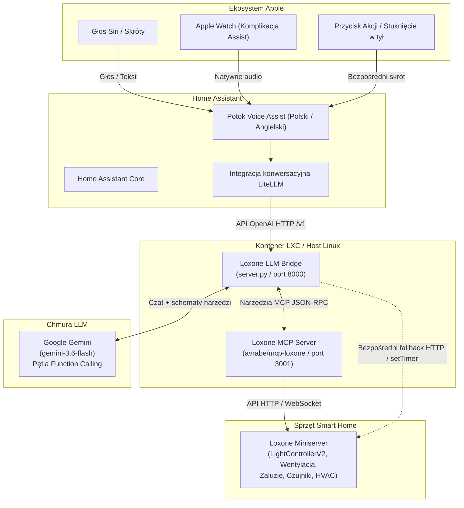

# Loxone LLM Bridge 🏠🤖

> Mostek AI Agent (kompatybilny z OpenAI) dla Loxone Miniserver, umożliwiający naturalne sterowanie głosowe i tekstowe w języku polskim oraz angielskim za pośrednictwem Home Assistant, Siri, Skrótów iOS oraz Apple Watch.

[English (EN)](README.md) | [Polski (PL)](README_PL.md)

[](LICENSE)
[](https://www.python.org/)
[](https://www.home-assistant.io/integrations/litellm)
[](https://www.loxone.com/)

---

## 📐 Architektura



---

## ✨ Funkcje

- **🌐 Wsparcie wielojęzyczne**:
  - Domyślny język angielski (`LANGUAGE=en`).
  - Natywna obsługa języka polskiego (`LANGUAGE=pl`).
  - Prompty i formatowanie odpowiedzi dostosowane pod syntezatory mowy (czysty tekst bez gwiazdek markdown, hashy czy tabel).
- **💡 Inteligentne oświetlenie i nastroje Gen 2**:
  - Sterowanie na poziomie pomieszczenia: *„Włącz światło w salonie”*, *„Zgaś światła w sypialni”*.
  - Pełne wsparcie dla predefiniowanych scen i nastrojów Loxone Gen 2 (`LightControllerV2`): *„Wieczór w salonie”*, *„Noc w sypialni”*, *„Tryb jedzenie w salonie”*, *„Xbox w salonie”*, *„Jasno w kuchni”*.
- **🍃 Wentylacja i rekuperacja z timerami**:
  - Sterowanie pojedynczymi pomieszczeniami lub całością: Gabinet, Kuchnia, Sypialnia, Cały dom.
  - Natywne timery Loxone z czasem trwania: *„Przewietrz kuchnię na 30 minut”*, *„Ustaw wentylację na 60% na godzinę”*, *„Wyłącz wentylację na 2 godziny”*.
  - Automatyczny powrót do bezpiecznego trybu automatycznego po upływie czasu.
- **🪟 Rolety i żaluzje**:
  - Pełna obsługa bloków Jalousie: *„Zasłoń rolety w salonie”*, *„Otwórz roletę w gabinecie”*.
- **📊 Odczyt czujników i energii w czasie rzeczywistym**:
  - Kontaktrony okienne i drzwiowe: *„Które okna są otwarte?”*.
  - Pomiar mocy na żywo: *„Ile prądu teraz zużywamy?”*.
  - Pomiar temperatury, wilgotności i regulatory pokojowe: *„Jaka jest temperatura w gabinecie?”*.
- **🔒 Bezpieczeństwo i prywatność**:
  - Dane logowania do Miniservera pozostają wyłącznie w Twojej sieci lokalnej.
  - Pełna konfiguracja przez zmienne środowiskowe (`.env`). Żadne hasła ani loginy nie są na stałe w kodzie.

---

## 🛠️ Wymagania

- **Loxone Miniserver** (Gen 1 lub Gen 2) z dostępem sieciowym.
- **Home Assistant** (2024.1+) z oficjalną integracją [LiteLLM](https://www.home-assistant.io/integrations/litellm).
- **Klucz API Google Gemini** (z [Google AI Studio](https://aistudio.google.com/)).
- **Host Linux lub kontener Proxmox LXC** (Debian 12/13 lub Ubuntu).

---

## 🚀 Instalacja i konfiguracja

### 1. Konfiguracja Loxone MCP Server (`mcp-loxone`)

Sklonuj i skompiluj Loxone MCP Server (z poprawkami dla Gen 2 z [PR #41](https://github.com/avrabe/mcp-loxone/pull/41)):

```bash
git clone https://github.com/cayco/mcp-loxone.git /opt/mcp-loxone
cd /opt/mcp-loxone
cargo build --release
cp target/release/loxone-mcp-server /usr/local/bin/
```

Utwórz plik konfiguracyjny `/etc/mcp-loxone/mcp-loxone.env`:
```ini
LOXONE_HOST=192.168.1.100
LOXONE_USER=twoja_nazwa_uzytkownika
LOXONE_PASS=twoje_haslo_loxone
```

Zainstaluj i uruchom usługę systemd:
```bash
cp systemd/mcp-loxone.service /etc/systemd/system/
systemctl daemon-reload
systemctl enable --now mcp-loxone.service
```

### 2. Konfiguracja Loxone LLM Bridge

Sklonuj niniejsze repozytorium do `/opt/loxone-agent`:

```bash
git clone https://github.com/cayco/loxone-llm.git /opt/loxone-agent
cd /opt/loxone-agent

# Utwórz środowisko wirtualne
python3 -m venv venv
source venv/bin/activate
pip install -r requirements.txt
```

Utwórz plik konfiguracyjny `/etc/loxone-agent/agent.env`:
```ini
GEMINI_API_KEY=twoj_klucz_gemini_api
GEMINI_MODEL=gemini-3.6-flash
LANGUAGE=pl
PORT=8000
MCP_URL=http://127.0.0.1:3001/mcp
LOXONE_HOST=192.168.1.100
LOXONE_USER=twoja_nazwa_uzytkownika
LOXONE_PASS=twoje_haslo_loxone
```

Zainstaluj i uruchom usługę:
```bash
cp systemd/loxone-agent.service /etc/systemd/system/
systemctl daemon-reload
systemctl enable --now loxone-agent.service
```

Sprawdź działanie mostka:
```bash
curl http://127.0.0.1:8000/v1/models
```

---

## 🔍 Jak znaleźć ID nastrojów i UUID bloków Loxone

W blokach Loxone Gen 2 (`LightControllerV2`) zmiana nastroju wymaga podania numerycznego ID poprzez komendę `changeTo/<id>` (np. `changeTo/1` dla Wieczoru, `changeTo/2` dla Jedzenia). Standardowe wbudowane tryby Loxone mają ID:
- **`777`**: Jasno / Pełne włączenie (`jasno` / `bright`)
- **`778`**: Wyłączenie (`wyłącz` / `off`)

Aby odnaleźć ID i UUID w Twojej instalacji:

### Metoda 1: Odczyt struktury JSON w przeglądarce
Wpisz w przeglądarce adres Miniservera z danymi logowania:
```
http://<LOXONE_USER>:<LOXONE_PASS>@<LOXONE_HOST>/data/LoxAPP3.json
```
1. Wyszukaj w pliku ciąg `"type": "LightControllerV2"`.
2. Odszukaj kontroler oświetlenia danego pokoju (np. Salon).
3. UUID bloku znajduje się w polu `"uuidAction"` (np. `1dbbcc92-01ab-5571-ffffba1e5675f352`).
4. W sekcji `"details"` znajdziesz tablicę `"moods"` z obiektami posiadającymi pola `"id"` (np. `1`, `2`, `3`) oraz `"name"` (np. `"Wieczór"`, `"Jedzenie"`, `"Xbox"`).

### Metoda 2: Sprawdzenie w Loxone Config
1. Otwórz projekt w programie **Loxone Config**.
2. Kliknij blok **Sterownik oświetlenia V2** (Light Controller V2) wybranego pomieszczenia.
3. W oknie konfiguracji nastrojów każdy nastrój ma przypisany numeryczny numer pozycji.
4. UUID bloku widoczne jest w dolnym panelu właściwości w sekcji **Identyfikacja**.

### Konfiguracja `moods.json`
Skopiuj plik [`moods.example.json`](moods.example.json) do `moods.json` i uzupełnij go odnalezionymi identyfikatorami:
```json
{
  "light_moods": {
    "salon": {
      "uuid": "TUTAJ_UUID_STEROWNIKA_OSWIETLENIA",
      "moods": {
        "jasno": 777,
        "wylacz": 778,
        "wieczor": 1,
        "jedzenie": 2,
        "noc": 3,
        "xbox": 4
      }
    }
  },
  "ventilation_controls": {
    "gabinet": "TUTAJ_UUID_WENTYLACJI",
    "kuchnia": "TUTAJ_UUID_WENTYLACJI"
  }
}
```

---

## 🏡 Konfiguracja w Home Assistant

1. W Home Assistant przejdź do **Ustawienia** $\rightarrow$ **Urządzenia oraz usługi** $\rightarrow$ **Dodaj integrację**.
2. Wyszukaj **LiteLLM**.
3. Wprowadź ustawienia połączenia:
   - **API Base**: `http://<IP_MOSTKA>:8000/v1`
   - **API Key**: `dummy` (lub dowolny ciąg znaków)
4. Przejdź do **Ustawienia** $\rightarrow$ **Asystenci głosowi** $\rightarrow$ **Home Assistant**:
   - Ustaw **Agent konwersacji** na **LiteLLM**.
   - Ustaw **Język** na preferowany (np. **Polski** lub **Angielski**).

---

## 📱 Konfiguracja iOS, Siri i Apple Watch

### Opcja A: Komplikacja Assist na Apple Watch (Rekomendowane na zegarek)
1. Zainstaluj aplikację **Home Assistant** na Apple Watch.
2. Dodaj komplikację **Assist** do tarczy zegarka.
3. Dotknięcie komplikacji od razu otwiera natywny mikrofon słuchający w Twoim języku i przesyła komendę bezpośrednio do agenta.

### Opcja B: Przycisk Akcji iPhone / Stuknięcie w tył
1. Na iPhone 15 Pro / 16: Przejdź do **Ustawienia** $\rightarrow$ **Przycisk czynności** $\rightarrow$ przypisz Skrót uruchamiający Asystenta Home Assistant (Assist).
2. Na dowolnym iPhone: Przejdź do **Ustawienia** $\rightarrow$ **Dostępność** $\rightarrow$ **Dotyk** $\rightarrow$ **Stuknięcie w tył** (dwukrotne lub trzykrotne).

---

## 🗣️ Przykładowe komendy głosowe

| Kategoria | Przykładowa komenda | Działanie |
|---|---|---|
| **Oświetlenie** | *„Włącz światło w gabinecie”* | Włącza oświetlenie w danym pokoju |
| **Nastroje / Sceny** | *„Wieczór w salonie”* | Aktywuje nastrój Wieczór (ID 1) na LightControllerV2 |
| **Nastroje / Sceny** | *„Włącz tryb jedzenie w salonie”* | Aktywuje nastrój Jedzenie / Obiad (ID 2) |
| **Nastroje / Sceny** | *„Noc w sypialni”* | Aktywuje scenę nocną w sypialni |
| **Wentylacja** | *„Przewietrz gabinet”* | Uruchamia 100% obrotów na domyślne 15 minut |
| **Wentylacja z czasem** | *„Włącz wietrzenie w kuchni na 30 minut”* | Aktywuje timer rekuperacji na 30 minut |
| **Wentylacja** | *„Ustaw wentylację na 60% na godzinę”* | Ustawia 60% prędkości na 60 minut |
| **Wentylacja** | *„Ustaw wentylację na tryb automatyczny”* | Resetuje centrale wentylacyjne do trybu auto |
| **Rolety** | *„Zasłoń rolety w salonie”* | Opuszcza rolety (Jalousie FullDown) |
| **Czujniki** | *„Które okna są otwarte?”* | Sprawdza kontaktrony okienne |
| **Energia** | *„Ile prądu teraz zużywamy?”* | Odczytuje aktualną moc z licznika głównego |

---

## 📄 Licencja

Projekt jest udostępniany na zasadach open-source na licencji [MIT](LICENSE).
